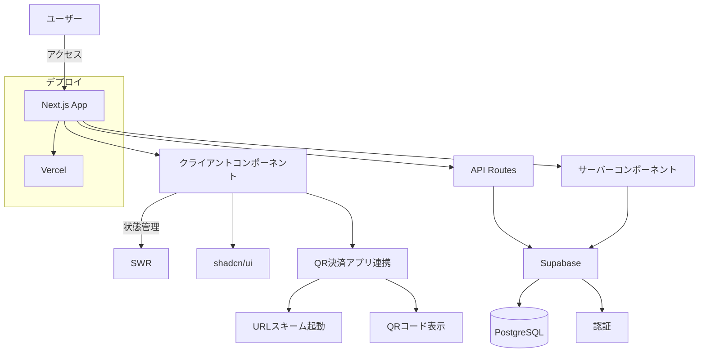
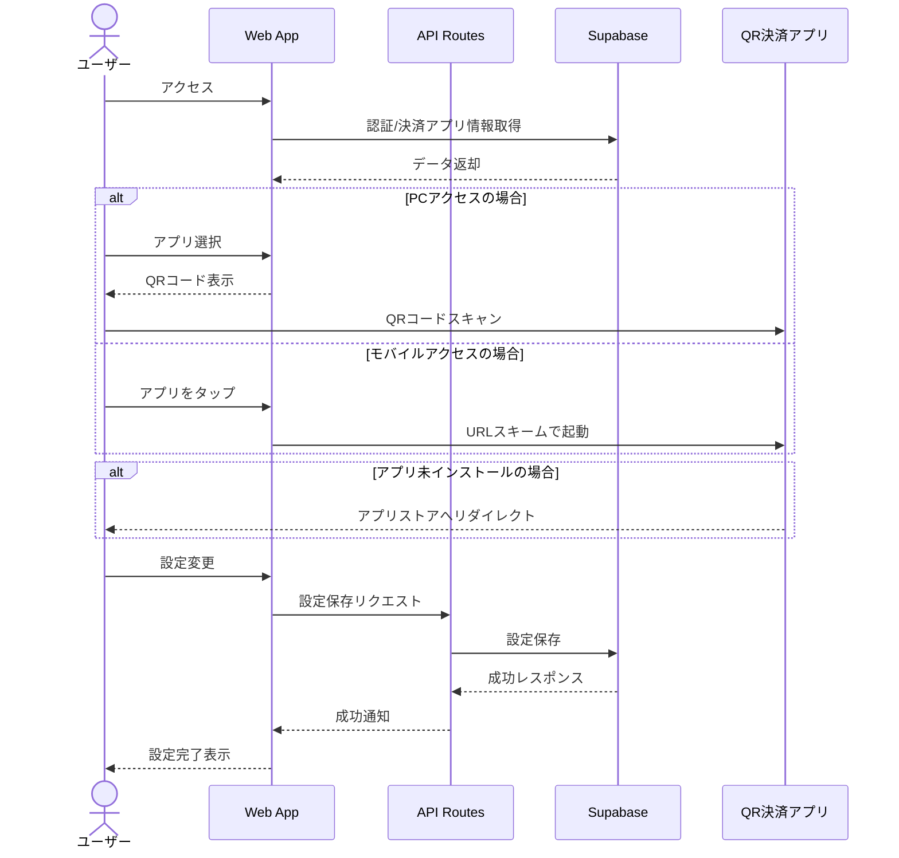

# QR決済アプリHub

複数のQR決済アプリの情報を一元管理し、シームレスな支払い体験を提供するWebアプリケーションです。

## 概要

このアプリケーションは、PayPay、LINE Pay、楽天ペイなど複数のQR決済アプリを一元管理し、素早くアクセスできるようにするためのハブとして機能します。PCやスマートフォンのブラウザからアクセスでき、各QR決済アプリへのURLスキームを通じて素早く起動することができます。

## 主な機能

- **マルチプラットフォーム対応**: PC、スマートフォン、タブレットなど様々なデバイスで利用可能
- **QR決済アプリ統合**: 主要なQR決済アプリへのクイックアクセス
- **カスタマイズ可能**: 利用するアプリを選択して、自分専用のダッシュボードを作成
- **クロスプラットフォーム連携**: PCでのQRコード表示機能によるシームレスな連携
- **適応型UI**: デバイスに応じた最適な表示とインタラクション
- **ダークモード対応**: システム設定に連動した表示モードの自動切り替え

## 技術スタック

- **フロントエンド**: 
  - Next.js 15.2.4 (App Router)
  - React 19
  - TypeScript
  - Tailwind CSS
  - shadcn/ui (UIコンポーネントライブラリ)
- **状態管理**: SWR
- **バックエンド**: Next.js API Routes
- **認証**: Supabase Authentication
- **データベース**: Supabase (PostgreSQL)
- **ホスティング**: Vercel
- **その他**:
  - QRコード生成: qrcode.react
  - アイコン: Lucide React
  - フォーム管理: React Hook Form
  - バリデーション: Zod 
  - 通知: Sonner

## アーキテクチャ概要



## アプリケーションフロー



## セットアップ手順

### 前提条件

- Node.js 18.x以上
- npm または yarn
- Supabaseアカウント（将来的な機能拡張時に必要）

### インストール

```bash
# リポジトリのクローン
git clone https://github.com/yourusername/QRApp.git
cd QRApp/qr-app

# 依存関係のインストール
npm install

# 環境変数の設定
cp .env.local.example .env.local
# .env.localを編集してSupabase URLとAPIキーを設定

# 開発サーバーの起動
npm run dev
```

### ビルドと本番環境へのデプロイ

```bash
# プロダクションビルドの作成
npm run build

# ビルドの確認
npm start

# Vercelへのデプロイ
vercel
```

## 特徴的な実装

### デバイス検出とアダプティブUI

ユーザーエージェントに基づいて最適な体験を提供:
- モバイル端末: アプリを直接起動
- PC: QRコードを表示してモバイル連携

### アプリ起動のフォールバックメカニズム

1. URLスキームでアプリ起動を試行
2. アプリが未インストールの場合、適切なアプリストアに誘導
3. ストアも利用できない場合、Webサイトにフォールバック

### UIコンポーネントライブラリ

shadcn/uiを活用した高品質なUIコンポーネント:
- アクセシブルなデザイン
- ダークモード対応
- カスタマイズ可能なコンポーネント
- Radix UIをベースとした堅牢な実装

## 将来の展望

- 各QR決済アプリの残高表示機能
- ポイント情報の統合管理
- キャンペーン情報の一元表示
- 支出管理・分析機能
- PWA対応
- Universal Linksの実装

## ライセンス

MIT

## 貢献

バグ報告や機能追加のリクエストは、Issueを作成してください。プルリクエストも歓迎します。