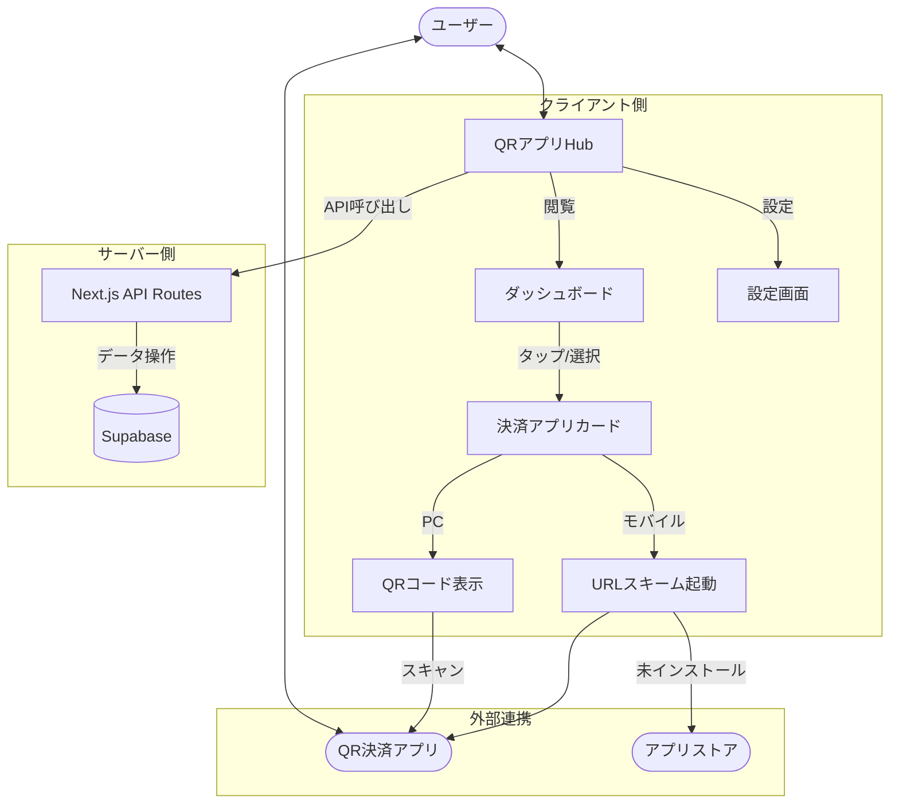
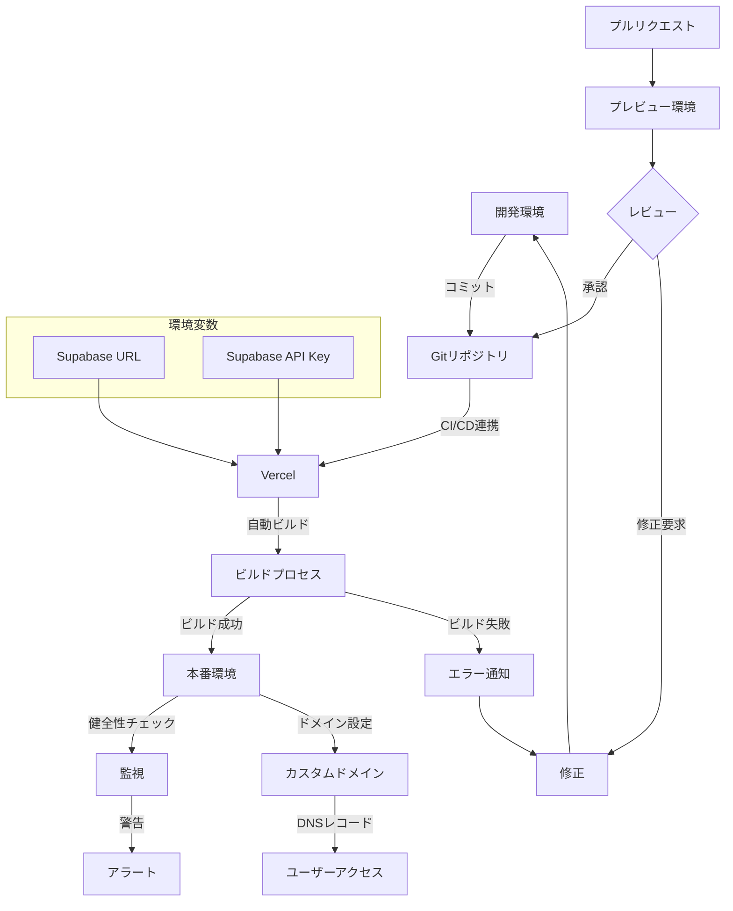

# QR決済アプリHub Webアプリケーション デプロイガイド

このドキュメントは、QR決済アプリHub Webアプリケーションの開発環境セットアップから本番環境へのデプロイまでの手順を説明します。

## 1. 開発環境セットアップ

### Next.js環境のセットアップ

1. **Node.jsのインストール**
   - [Node.js公式サイト](https://nodejs.org/)から最新のLTS版をダウンロード
   - インストール後、ターミナルで確認:
     ```bash
     node -v
     npm -v
     ```

2. **プロジェクトの作成**
   ```bash
   # npxを使用してNext.jsプロジェクトを作成（TypeScript対応）
   npx create-next-app@latest qr-payment-hub --typescript
   cd qr-payment-hub
   ```

3. **必要なパッケージのインストール**
   ```bash
   # ベースライブラリ
   npm install @supabase/supabase-js swr qrcode.react

   # スタイリング
   npm install tailwindcss postcss autoprefixer
   npx tailwindcss init -p
   
   # UI コンポーネント
   npx shadcn-ui@latest init
   
   # コンポーネントのインストール (必要に応じて)
   npx shadcn-ui@latest add button card dialog form input
   
   # アイコンとUI拡張
   npm install lucide-react sonner react-hook-form zod @hookform/resolvers
   
   # 開発ツール
   npm install -D @types/qrcode.react
   ```

4. **Tailwind CSSの設定**
   
   `tailwind.config.js`を編集:
   ```javascript
   module.exports = {
     content: [
       "./pages/**/*.{js,ts,jsx,tsx}",
       "./components/**/*.{js,ts,jsx,tsx}",
     ],
     theme: {
       extend: {},
     },
     plugins: [],
   }
   ```
   
   `styles/globals.css`を編集:
   ```css
   @tailwind base;
   @tailwind components;
   @tailwind utilities;
   ```

### Supabase環境のセットアップ

1. **Supabaseアカウントの作成**
   - [Supabase公式サイト](https://supabase.com/)にアクセス
   - GitHubアカウントでサインアップ

2. **新しいプロジェクトの作成**
   - Supabaseダッシュボードから「New Project」をクリック
   - プロジェクト名、パスワード、リージョンを設定
   - 無料枠で十分な機能が利用可能

3. **データベーススキーマの設定**
   - SQLエディタを開く
   - 設計書に記載されたテーブル作成SQLを実行

4. **APIキーとURLの取得**
   - プロジェクト設定 > API から以下の情報をコピー:
     - Project URL
     - anon/public key
   - これらは後でNext.jsアプリに設定します

5. **RLSポリシーの設定**
   - Authentication > Policies からテーブルごとのRLSを有効化
   - 各テーブルに必要なポリシーを追加

## 2. ローカル開発環境の設定

1. **環境変数の設定**

   プロジェクトルートに`.env.local`ファイルを作成:
   ```
   NEXT_PUBLIC_SUPABASE_URL=https://your-project.supabase.co
   NEXT_PUBLIC_SUPABASE_ANON_KEY=your-anon-key
   ```

2. **Supabaseクライアントの設定**

   `lib/supabase.ts`ファイルを作成:
   ```typescript
   import { createClient } from '@supabase/supabase-js';

   const supabaseUrl = process.env.NEXT_PUBLIC_SUPABASE_URL!;
   const supabaseAnonKey = process.env.NEXT_PUBLIC_SUPABASE_ANON_KEY!;

   export const supabase = createClient(supabaseUrl, supabaseAnonKey);
   ```

3. **認証コンポーネントの作成**

   `components/Auth.tsx`を作成:
   ```tsx
   import { useState } from 'react';
   import { supabase } from '../lib/supabase';

   export default function Auth() {
     const [loading, setLoading] = useState(false);
     const [email, setEmail] = useState('');
     
     const handleLogin = async (e: React.FormEvent) => {
       e.preventDefault();
       setLoading(true);
       
       const { error } = await supabase.auth.signIn({ email });
       
       if (error) {
         alert(error.message);
       } else {
         alert('Check your email for the login link!');
       }
       setLoading(false);
     };
     
     return (
       <div className="max-w-md mx-auto p-6 bg-white rounded-lg shadow-md">
         <h1 className="text-2xl font-bold mb-6">QR決済アプリHub</h1>
         <p className="mb-4">サインインして、あなた専用のQR決済ハブを設定しましょう。</p>
         <form onSubmit={handleLogin}>
           <input
             className="w-full p-2 border rounded mb-4"
             type="email"
             placeholder="メールアドレス"
             value={email}
             onChange={(e) => setEmail(e.target.value)}
             required
           />
           <button
             className="w-full bg-blue-500 text-white p-2 rounded"
             type="submit"
             disabled={loading}
           >
             {loading ? '処理中...' : 'マジックリンクを送信'}
           </button>
         </form>
       </div>
     );
   }
   ```

4. **初期データのセットアップ**

   Supabase SQLエディタで実行:
   ```sql
   -- QR決済アプリのサンプルデータ
   INSERT INTO payment_apps (name, logo_url, web_url, ios_url_scheme, android_url_scheme, app_store_url, play_store_url)
   VALUES
   ('PayPay', 'https://example.com/paypay.png', 'https://paypay.ne.jp/', 'paypay://', 'jp.ne.paypay.android.app://', 'https://apps.apple.com/jp/app/paypay/id1435783608', 'https://play.google.com/store/apps/details?id=jp.ne.paypay.android'),
   ('LINE Pay', 'https://example.com/linepay.png', 'https://line.me/ja/pay', 'line://', 'line://', 'https://apps.apple.com/jp/app/line/id443904275', 'https://play.google.com/store/apps/details?id=jp.naver.line.android'),
   ('楽天ペイ', 'https://example.com/rakutenpay.png', 'https://pay.rakuten.co.jp/', 'rakutenpay://', 'jp.co.rakuten.pay://', 'https://apps.apple.com/jp/app/楽天ペイ/id1139755229', 'https://play.google.com/store/apps/details?id=jp.co.rakuten.pay');
   ```

5. **開発サーバーの起動**

   ```bash
   npm run dev
   ```

   ブラウザで http://localhost:3000 にアクセスして動作確認

## 3. アプリケーションの基本実装

### 1. ホームページの作成

`pages/index.tsx`を編集:

```tsx
import { useState, useEffect } from 'react';
import { supabase } from '../lib/supabase';
import Auth from '../components/Auth';
import PaymentAppGrid from '../components/PaymentAppGrid';

export default function Home() {
  const [session, setSession] = useState(null);
  
  useEffect(() => {
    // セッション状態の取得と監視
    setSession(supabase.auth.session());
    
    const { data: authListener } = supabase.auth.onAuthStateChange(
      (_, session) => {
        setSession(session);
      }
    );
    
    return () => {
      authListener?.unsubscribe();
    };
  }, []);
  
  return (
    <div className="min-h-screen bg-gray-50">
      <div className="max-w-4xl mx-auto px-4 py-8">
        {!session ? (
          <Auth />
        ) : (
          <PaymentAppGrid userId={session.user.id} />
        )}
      </div>
    </div>
  );
}
```

### 2. 決済アプリカードの実装

`components/PaymentAppCard.tsx`を作成:

```tsx
import Image from 'next/image';
import { useCallback } from 'react';
import QRCode from 'qrcode.react';

export default function PaymentAppCard({ app, isMobile }) {
  const handleOpenApp = useCallback(() => {
    const userAgent = navigator.userAgent.toLowerCase();
    const isIOS = /iphone|ipad|ipod/.test(userAgent);
    const isAndroid = /android/.test(userAgent);
    
    let url = app.web_url; // デフォルトはウェブURL
    
    if (isIOS && app.ios_url_scheme) {
      url = app.ios_url_scheme;
    } else if (isAndroid && app.android_url_scheme) {
      url = app.android_url_scheme;
    }
    
    // タイムアウトでアプリ起動確認
    const timeout = setTimeout(() => {
      // アプリが起動
```

## 4. MCP (Minimum Competitive Product) 実装状況

MCPの実装が完了しました。現在の実装状況は以下の通りです：

### アプリケーションデータフロー



### 実装済み機能

1. **基本的なQR決済アプリへのアクセス機能**
   - モバイル端末でのURLスキームを利用した決済アプリ起動
   - PC環境でのQRコード表示によるモバイル連携
   - アプリがインストールされていない場合のストア誘導

2. **UIコンポーネント**
   - Next.js App RouterとTypeScriptによる実装
   - モダンなUI/UXと完全レスポンシブデザイン
   - shadcn/uiを活用したアクセシブルなコンポーネント
   - ダークモード対応
   - サブスクリプションベースのデータ取得

3. **APIエンドポイント**
   - 決済アプリ情報取得API
   - ユーザー設定保存API

### 技術スタック

- **フロントエンド**: 
  - Next.js 15.2.4 (App Router)
  - React 19
  - TypeScript
  - Tailwind CSS
  - Turbopack
  - shadcn/ui (Radixベースのコンポーネント)
  
- **データ管理**:
  - SWR
  - Supabase SDK

- **UI/UX**:
  - Lucide React (アイコン)
  - Sonner (通知システム)
  - QRCode.react
  - React Hook Form
  - Zod (バリデーション)

- **デプロイ**: Vercel

### 次のステップ

1. **拡張機能開発**
   - 残高表示機能（各アプリのAPIが提供する場合）
   - キャンペーン情報表示
   - ユーザー設定の詳細カスタマイズ

2. **認証強化**
   - ソーシャルログイン対応
   - パスワードレス認証の実装

3. **パフォーマンス最適化**
   - 画像最適化
   - バンドルサイズの削減
   - キャッシュ戦略の最適化

## 5. 本番環境デプロイ手順

### デプロイフロー



### Vercelへのデプロイ設定と実行

1. **Vercelアカウントの作成**
   - [Vercel公式サイト](https://vercel.com/)にアクセス
   - GitHubアカウントなどでサインアップ

2. **プロジェクトのインポート**
   ```bash
   # Vercel CLIのインストール
   npm install -g vercel
   
   # プロジェクトディレクトリで実行
   cd qr-app
   vercel
   ```

   または、Vercelダッシュボードから「New Project」を選択し、GitHubリポジトリを連携

3. **環境変数の設定**

   Vercelのプロジェクト設定から以下の環境変数を設定します：
   ```
   NEXT_PUBLIC_SUPABASE_URL=https://your-project.supabase.co
   NEXT_PUBLIC_SUPABASE_ANON_KEY=your-anon-key
   ```

4. **ビルド設定の確認**

   - フレームワークプリセット: `Next.js`
   - ビルドコマンド: `next build`
   - 出力ディレクトリ: `.next`
   - インストールコマンド: `npm install`

5. **デプロイの実行**

   設定を確認後、「Deploy」ボタンをクリックしてデプロイを開始します。

6. **デプロイ後の確認**

   - デプロイが完了したら、提供されたURLにアクセスして動作確認
   - 必要に応じてカスタムドメインを設定

### カスタムドメインの設定

1. **ドメインの購入**
   - お好みのドメインレジストラでドメインを購入

2. **Vercelプロジェクトへのドメイン追加**
   - Vercelダッシュボードの「Domains」セクションから「Add」をクリック
   - 購入したドメインを入力

3. **DNSレコードの設定**
   - Vercelが提供する指示に従って、ドメインレジストラでDNSレコードを設定
   - 主に以下のレコードが必要:
     - A レコード: @ → 76.76.21.21
     - CNAME レコード: www → cname.vercel-dns.com

4. **SSL/TLS証明書の自動設定**
   - Vercelは自動的にSSL証明書を発行・更新

### 継続的デプロイ（CI/CD）の設定

1. **GitHubリポジトリとの連携**
   - Vercelプロジェクト設定の「Git」タブから、GitHubリポジトリと連携

2. **自動デプロイの設定**
   - 「Production Branch」を `main` または `master` に設定
   - プレビュー機能を有効化して、プルリクエストごとのプレビューデプロイを設定

3. **ブランチデプロイルールの設定**
   - 開発環境、ステージング環境、本番環境などの複数環境を管理する場合、
     ブランチごとのデプロイ設定を行います

### 現在の実行状況

現在のアプリケーションは開発サーバーで実行中です：

```
> qr-app@0.1.0 dev
> next dev --turbopack
 ⚠ Port 3000 is in use, trying 3001 instead.
   ▲ Next.js 15.2.4 (Turbopack)
   - Local:        http://localhost:3001
   - Network:      http://192.168.0.6:3001
   - Environments: .env.local
 ✓ Starting...
 ✓ Ready in 787ms
```

本番環境では、次のコマンドでビルドと起動を行います：

```bash
# プロダクションビルド
npm run build

# 本番サーバー起動
npm run start
```

### 監視とメンテナンス

1. **エラー監視の設定**
   - Vercel Analytics の設定
   - Sentry などの外部エラー監視ツールの統合

2. **パフォーマンス監視**
   - Vercel Analytics でのパフォーマンス指標モニタリング
   - Google Analytics の設定

3. **定期的なアップデート**
   - 依存パッケージの更新
   - セキュリティパッチの適用
   - Node.js バージョンの更新