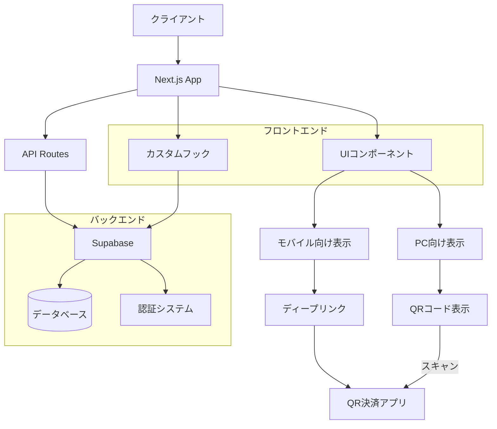
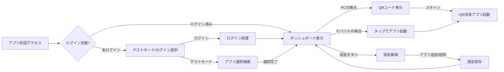
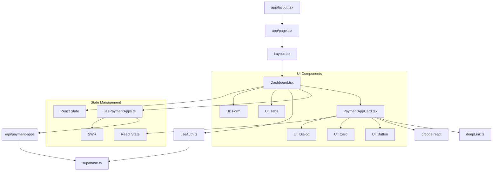

# QR決済アプリHub Webアプリケーション設計書

## 1. 概要

複数のQR決済アプリの情報を一元管理し、シームレスな支払い体験を提供するWebアプリケーションの設計書です。ユーザーはPCやスマートフォンのブラウザからアクセスでき、各QR決済アプリへのリンクを通じて素早く決済アプリを起動できます。

### フェーズ1（MVP）
- 各QR決済アプリへのURLスキームによる遷移機能
- レスポンシブなUI/UXデザイン

### フェーズ2以降
- 各アプリの残高表示
- ポイント情報表示
- キャンペーン情報の表示

## 2. 技術要素

### フロントエンド
- **フレームワーク**: Next.js (React)
  - SSRによる高速な初期ロード
  - SEO対策が容易
  - レスポンシブデザインの実装が容易
  - TypeScriptサポート
  - App Routerによる最新のサーバーコンポーネントモデル

- **スタイリング**: Tailwind CSS
  - ユーティリティファーストのアプローチ
  - レスポンシブデザインの効率的な構築
  - カスタマイズ性の高さ

- **UIコンポーネント**: shadcn/ui
  - Radix UIをベースとした高品質コンポーネント
  - アクセシビリティ対応
  - ダークモード対応
  - カスタマイズ可能なコンポーネント設計

### バックエンド
- **フレームワーク**: Next.js API Routes
  - フロントエンドと統合された開発環境
  - サーバーレス機能によるスケーリング

### データベース
- **Supabase**
  - PostgreSQLベースの堅牢なデータベース
  - リアルタイムサブスクリプション機能
  - 組み込み認証システム
  - RLS (Row Level Security) によるデータ保護
  - 拡張性の高いストレージソリューション

### ホスティング
- **Vercel**
  - Next.jsに最適化されたホスティング
  - グローバルCDN
  - 自動デプロイとプレビュー機能
  - 無料枠あり

### 認証
- **Supabase Authentication**
  - メール/パスワード認証
  - ソーシャルログイン（Google, Appleなど）
  - JWTトークンベースの認証

## 3. アプリ構造

### プロジェクト構成
```
app/
├── components/            // 主要コンポーネント
│   ├── Dashboard.tsx      // メインダッシュボード
│   ├── PaymentAppCard.tsx // 決済アプリカード
│   └── Layout.tsx         // 共通レイアウト
├── hooks/                 // カスタムフック
│   ├── useAuth.ts         // 認証処理
│   └── usePaymentApps.ts  // 決済アプリデータ取得
├── lib/                   // ユーティリティ
│   ├── supabase.ts        // Supabase連携
│   └── deepLink.ts        // アプリ起動関連
├── api/                   // APIルートエンドポイント
│   └── payment-apps/      // 決済アプリAPI
├── types/                 // 型定義
├── page.tsx               // ホームページ
└── layout.tsx             // 基本レイアウト
```

### アーキテクチャ構成図



### データモデル (Supabase)
```sql
-- 決済アプリテーブル
CREATE TABLE payment_apps (
  id UUID PRIMARY KEY DEFAULT uuid_generate_v4(),
  name TEXT NOT NULL,
  logo_url TEXT,
  web_url TEXT,          -- 通常のWebリンク
  ios_url_scheme TEXT,   -- iOSディープリンク
  android_url_scheme TEXT, -- Androidディープリンク
  app_store_url TEXT,
  play_store_url TEXT,
  api_available BOOLEAN DEFAULT false,
  created_at TIMESTAMP WITH TIME ZONE DEFAULT NOW()
);

-- ユーザープロファイル
CREATE TABLE profiles (
  id UUID PRIMARY KEY REFERENCES auth.users(id),
  email TEXT,
  created_at TIMESTAMP WITH TIME ZONE DEFAULT NOW(),
  updated_at TIMESTAMP WITH TIME ZONE DEFAULT NOW()
);

-- ユーザーの決済アプリ設定
CREATE TABLE user_payment_apps (
  id UUID PRIMARY KEY DEFAULT uuid_generate_v4(),
  user_id UUID REFERENCES profiles(id) ON DELETE CASCADE,
  payment_app_id UUID REFERENCES payment_apps(id) ON DELETE CASCADE,
  display_order INTEGER,
  is_active BOOLEAN DEFAULT true,
  created_at TIMESTAMP WITH TIME ZONE DEFAULT NOW(),
  UNIQUE(user_id, payment_app_id)
);

-- 残高情報（フェーズ2）
CREATE TABLE balance_info (
  id UUID PRIMARY KEY DEFAULT uuid_generate_v4(),
  user_id UUID REFERENCES profiles(id) ON DELETE CASCADE,
  payment_app_id UUID REFERENCES payment_apps(id) ON DELETE CASCADE,
  balance DECIMAL,
  points DECIMAL,
  last_updated TIMESTAMP WITH TIME ZONE DEFAULT NOW(),
  UNIQUE(user_id, payment_app_id)
);
```

## 4. 技術的課題と解決策

### 1. Web環境からモバイルアプリへの遷移
**課題**: ブラウザからQR決済アプリを起動する方法の実装

**解決策**:
- URLスキームによるディープリンク
- UA検出によるデバイス分岐（iOS/Android/PC）
- PCブラウザからはQRコード表示機能の追加

```typescript
// デバイスタイプに応じてURLを生成する関数
export function getAppLink(app: PaymentApp): string {
  // ユーザーエージェントでデバイス検出
  const userAgent = navigator.userAgent.toLowerCase();
  const isIOS = /iphone|ipad|ipod/.test(userAgent);
  const isAndroid = /android/.test(userAgent);
  
  if (isIOS && app.ios_url_scheme) {
    return app.ios_url_scheme;
  } else if (isAndroid && app.android_url_scheme) {
    return app.android_url_scheme;
  } else {
    // PCやその他のデバイスの場合は通常のWebURLを返す
    return app.web_url;
  }
}

// アプリを開く関数
export function openPaymentApp(app: PaymentApp): void {
  const link = getAppLink(app);
  
  // タイムアウトでアプリ起動確認
  const timeout = setTimeout(() => {
    // アプリが起動しなかった場合はストアページへ
    window.location.href = isIOS ? app.app_store_url : app.play_store_url;
  }, 1000);
  
  // リンクを開く
  window.location.href = link;
  
  // イベントリスナーでタイムアウトをクリア
  window.addEventListener('pagehide', () => {
    clearTimeout(timeout);
  });
}
```

### 2. PC環境での利便性向上
**課題**: PCユーザーはQRコードをスキャンして利用する必要がある

**解決策**:
- QRコード生成機能の実装
- スマートフォンでスキャンして対応アプリに遷移

```tsx
// QRコード表示コンポーネント
import QRCode from 'qrcode.react';

const QRCodeDisplay = ({ url, appName }) => {
  return (
    <div className="p-4 text-center">
      <h3 className="mb-2 font-bold">{appName}を起動</h3>
      <div className="inline-block p-2 bg-white rounded-lg">
        <QRCode value={url} size={180} />
      </div>
      <p className="mt-2 text-sm text-gray-600">
        スマートフォンでスキャンして{appName}を開きます
      </p>
    </div>
  );
};
```

### 3. レスポンシブデザインの実装
**課題**: 様々なデバイスサイズに対応したUI設計

**解決策**:
- Tailwind CSSのレスポンシブユーティリティを活用
- モバイルファーストのデザインアプローチ
- メディアクエリによる条件付きレンダリング

```tsx
// レスポンシブなグリッドレイアウト例
<div className="grid grid-cols-2 gap-4 sm:grid-cols-3 md:grid-cols-4 lg:grid-cols-5">
  {paymentApps.map(app => (
    <PaymentAppCard key={app.id} app={app} />
  ))}
</div>
```

### 4. Supabaseとの連携
**課題**: リアルタイムデータ同期と認証の実装

**解決策**:
- Supabase Javascriptクライアントの利用
- SWRを使用したデータフェッチングと状態管理
- サーバーサイドでのセッション検証

```typescript
// Supabaseクライアントの設定
import { createClient } from '@supabase/supabase-js';

const supabaseUrl = process.env.NEXT_PUBLIC_SUPABASE_URL as string;
const supabaseAnonKey = process.env.NEXT_PUBLIC_SUPABASE_ANON_KEY as string;

export const supabase = createClient(supabaseUrl, supabaseAnonKey);

// カスタムフックを使用したデータ取得
import useSWR from 'swr';

export function usePaymentApps() {
  const { data, error, mutate } = useSWR('payment-apps', async () => {
    const res = await fetch('/api/payment-apps');
    if (!res.ok) throw new Error('Failed to fetch');
    return res.json();
  });
  
  return {
    paymentApps: data,
    isLoading: !error && !data,
    isError: error,
    mutate
  };
}
```

## 5. ユーザーフロー（MVP）

### ユーザージャーニー図



1. **アプリ初回アクセス**
   - Webブラウザでサイトにアクセス
   - ユーザー登録またはゲストモードを選択
   - 利用するQR決済アプリの選択

2. **ダッシュボード画面**
   - 選択した決済アプリのグリッド表示
   - モバイルの場合：タップでURLスキームにより対応アプリを起動
   - PCの場合：QRコードを表示して、スマホでスキャン可能

3. **設定画面**
   - 表示アプリの追加・削除
   - 表示順のカスタマイズ
   - テーマ設定（ライト/ダークモード）

## 6. サポート対象QR決済アプリ（日本市場向け）

### 初期サポート（MVP）
- PayPay
- LINE Pay
- 楽天ペイ
- d払い
- au PAY
- メルペイ

### 将来的な拡張
- ファミペイ
- PayB
- ゆうちょPay
- その他地域・業界特化型QRコード決済

## 7. 開発ロードマップ

### フェーズ1（MVP）- 1-2ヶ月
- Next.js環境構築
- Supabaseセットアップとテーブル設計
- 認証フロー実装
- レスポンシブUI/UX設計
- URLスキーム連携実装（モバイル）
- QRコード表示機能（PC）
- Vercelへのデプロイ

### フェーズ2 - 2-3ヶ月
- 残高表示機能
- ポイント情報表示
- リアルタイムデータ同期
- ユーザー設定の保存と同期

### フェーズ3 - 3-4ヶ月
- キャンペーン情報表示
- 利用履歴表示
- PWA対応（オフライン機能）
- 多言語対応

## 8. Next.js特有の開発手法

### SSR/SSG活用
- 初期ロード時のパフォーマンス向上
- SEO対策
- データプリフェッチ

```typescript
// getServerSidePropsの例
export async function getServerSideProps({ req }) {
  const { user } = await supabase.auth.api.getUserByCookie(req);
  
  if (!user) {
    return {
      redirect: {
        destination: '/login',
        permanent: false,
      },
    };
  }
  
  const { data } = await supabase
    .from('payment_apps')
    .select('*');
    
  return {
    props: {
      initialData: data || [],
    },
  };
}
```

### API Routes
- サーバーサイドロジックの実装
- 外部APIとの連携
- 認証と認可の処理

```typescript
// API Routeの例
import type { NextApiRequest, NextApiResponse } from 'next';
import { supabase } from '../../lib/supabase';

export default async function handler(
  req: NextApiRequest,
  res: NextApiResponse
) {
  const { user } = await supabase.auth.api.getUserByCookie(req);
  
  if (!user) {
    return res.status(401).json({ error: 'Unauthorized' });
  }
  
  if (req.method === 'GET') {
    const { data, error } = await supabase
      .from('user_payment_apps')
      .select('*, payment_apps(*)')
      .eq('user_id', user.id)
      .order('display_order');
      
    if (error) return res.status(400).json({ error });
    return res.status(200).json(data);
  }
  
  return res.status(405).json({ error: 'Method not allowed' });
}
```

## 9. Supabase特有の開発手法

### データセキュリティ（RLS）
```sql
-- Row Level Security の設定例
ALTER TABLE user_payment_apps ENABLE ROW LEVEL SECURITY;

CREATE POLICY "ユーザーは自分のデータのみアクセス可能" 
  ON user_payment_apps 
  FOR ALL 
  USING (auth.uid() = user_id);
```

### リアルタイムサブスクリプション
```typescript
// リアルタイム更新の購読
const subscription = supabase
  .from('balance_info')
  .on('*', (payload) => {
    console.log('Change received!', payload);
    mutate(); // SWRのキャッシュを更新
  })
  .subscribe();

// クリーンアップ
return () => {
  subscription.unsubscribe();
};
```

## 10. Webアプリケーションのメリットと課題

### メリット
1. **クロスプラットフォーム互換性**:
   - PC、スマートフォン、タブレットなど様々なデバイスでアクセス可能
   - ブラウザがあれば利用可能（インストール不要）

2. **更新の容易さ**:
   - 更新はサーバーサイドで一括適用可能
   - ユーザーによるアップデート操作が不要

3. **低い開発コスト**:
   - 単一のコードベースで複数プラットフォームに対応
   - ストア審査プロセスが不要

4. **SEO対策とシェアリング**:
   - 検索エンジンからの流入が可能
   - SNSでのシェアが容易

### 課題と対策
1. **モバイルアプリ連携の制限**:
   - WebからのURLスキーム起動はOS/ブラウザによって動作が異なる
   - → デバイス検出とフォールバックメカニズムの実装

2. **オフライン対応**:
   - ネットワーク接続が必要
   - → PWA技術によるオフラインキャッシュの実装

3. **ネイティブ機能アクセス**:
   - カメラやプッシュ通知などの機能に制限がある
   - → PWAのWeb APIを活用

## 11. セキュリティ考慮事項

- Supabaseの認証システムを利用したJWTベースの認証
- RLSによるデータアクセス制御
- 環境変数による機密情報管理
- HTTPS通信の強制
- CSP (Content Security Policy) の実装
- CSRF対策

## 12. パフォーマンス最適化

- Next.jsのイメージ最適化
- コード分割とレイジーローディング
- キャッシュ戦略（SWR/React Query）
- Lighthouse監査の定期実施
- WebVitalsの監視

## 13. 将来的な拡張性

- PWA対応による疑似ネイティブ体験
- QRコード読み取り機能（WebカメラAPI利用）
- 決済履歴の分析と支出管理機能
- パーソナライズされたキャンペーン推奨
- 多言語対応と地域ローカライズ

## 14. デプロイと運用

- Vercelを使った自動デプロイ
- CI/CDパイプラインの構築（GitHub Actions）
- 監視とアラート設定
- アナリティクスによるユーザー行動分析
- A/Bテストの実施

## 15. まとめ

Next.js + Supabaseを採用したWebアプリケーションアプローチにより、PCとモバイルの両方に対応した柔軟なQR決済アプリHubを実現できます。URLスキームを活用したディープリンク機能とPC向けのQRコード表示機能により、様々なデバイスからQR決済アプリへのシームレスな遷移が可能になります。

MVPではWebブラウザからQR決済アプリへの起動機能に集中し、その後のフェーズで残高表示やキャンペーン情報など付加価値機能を順次実装していくことで、ユーザー体験を段階的に向上させることができます。

## 16. MCP実装の詳細と現状

### 実装アーキテクチャ

MCPでは、設計書に記載した技術要素のほとんどを実装しましたが、いくつかの点で最新のトレンドを取り入れた進化も行っています：

1. **Next.js App Router採用**
   - Pages Routerではなく、App Routerを採用し、より最新のNext.js機能を活用
   - Turbopackによる高速な開発体験
   - Serverコンポーネントとクライアントコンポーネントの適切な使い分け

2. **UI設計の拡張**
   - 当初設計以上に洗練されたUIを実現 (shadcn/uiライブラリ導入)
   - Radix UIをベースとした堅牢なコンポーネント
   - ダークモード対応
   - アニメーションとトランジション効果によるUX向上
   - アクセシビリティ対応

3. **デバイス最適化**
   - デバイス検出の精緻化
   - PCでのQRコード表示の実装
   - アプリ未インストール時のストア遷移フォールバック

### コンポーネント構成

```
app/
├── components/            // 主要コンポーネント
│   ├── Dashboard.tsx      // メインダッシュボード
│   ├── PaymentAppCard.tsx // 決済アプリカード
│   └── Layout.tsx         // 共通レイアウト
├── hooks/                 // カスタムフック
│   ├── useAuth.ts         // 認証処理
│   └── usePaymentApps.ts  // 決済アプリデータ取得
├── lib/                   // ユーティリティ
│   ├── supabase.ts        // Supabase連携
│   └── deepLink.ts        // アプリ起動関連
├── api/                   // APIルートエンドポイント
│   └── payment-apps/      // 決済アプリAPI
├── types/                 // 型定義
├── page.tsx               // ホームページ
└── layout.tsx             // 基本レイアウト
```

### コンポーネント関係図



### UIコンポーネントライブラリの活用

shadcn/uiを採用した理由と利点：

1. **再利用可能性**:
   - コンポーネントの一貫性を保ちながら、プロジェクト固有のニーズに合わせてカスタマイズ可能
   - コピー&ペーストモデルによる柔軟なコード管理

2. **アクセシビリティ**:
   - Radix UIをベースとしたアクセシビリティ対応
   - キーボードナビゲーション、スクリーンリーダー対応、フォーカス管理などの実装

3. **デザインシステムとの統合**:
   - Tailwind CSSと完全に互換
   - 一貫したデザイン言語の適用が容易

4. **テーマ対応**:
   - ダークモード/ライトモードの簡易な実装
   - カラースキームのカスタマイズ

主要なコンポーネント:
- Card: 決済アプリの表示
- Dialog: QRコード表示や設定画面
- Form: ユーザー設定
- Button: アクション要素
- Tooltip: ヘルプテキスト

### PaymentAppCardの実装詳細

PaymentAppCardは、モバイル/PC両方のユースケースを処理する中核コンポーネントです。その主な機能は：

1. **デバイス検出**:
   - UAに基づいてモバイルかPCかを判定
   - それぞれのデバイスに最適な表示とアクション

2. **アプリ起動処理**:
   - モバイル: URLスキームを使用して決済アプリを直接起動
   - PC: QRコードを表示し、モバイルでのスキャンを促進

3. **フォールバックメカニズム**:
   - アプリが見つからない場合にアプリストアへの誘導
   - visibilitychangeイベントを活用したアプリ起動検出

```typescript
// ユーザーのデバイスに応じたURLスキーム生成
const getAppLink = (app: PaymentApp): string => {
  const userAgent = navigator.userAgent.toLowerCase();
  const isIOS = /iphone|ipad|ipod/.test(userAgent);
  const isAndroid = /android/.test(userAgent);
  
  if (isIOS && app.ios_url_scheme) {
    return app.ios_url_scheme;
  } else if (isAndroid && app.android_url_scheme) {
    return app.android_url_scheme;
  }
  
  return app.web_url;
};

// アプリを起動する関数
const openPaymentApp = (app: PaymentApp): void => {
  const appLink = getAppLink(app);
  appLaunchState.lastAttemptedApp = app.id;
  appLaunchState.timeAttempted = Date.now();
  
  // アプリが起動しなかった場合のフォールバック
  const timeout = setTimeout(() => {
    window.location.href = getStoreLink(app) || app.web_url;
  }, 1000);
  
  // アプリへ遷移
  window.location.href = appLink;
  
  // アプリが起動したらタイムアウトをクリア
  window.addEventListener('pagehide', () => {
    clearTimeout(timeout);
  }, { once: true });
};
```

### データフェッチングパターン

MCPでは、以下のデータフェッチングパターンを実装しています：

1. **カスタムフックを使用したデータ取得**:
   ```typescript
   export function useUserPaymentApps() {
     const [userPaymentApps, setUserPaymentApps] = useState<UserPaymentApp[]>([]);
     const [isLoading, setIsLoading] = useState(true);
     const { user } = useAuth();
     
     // ユーザー設定の取得
     useEffect(() => {
       if (!user && localStorage.getItem('guestSelectedApps')) {
         // ゲストモード時はローカルストレージから取得
         fetchGuestApps();
       } else if (user) {
         // 認証ユーザーはAPIから取得
         fetchUserApps(user.id);
       } else {
         setIsLoading(false);
       }
     }, [user]);
     
     // 更新関数
     const updateUserPaymentApps = async (appIds: string[]) => {
       // APIを通じてデータ更新
     };
     
     return { userPaymentApps, isLoading, updateUserPaymentApps };
   }
   ```

2. **APIルートを活用したサーバーサイド処理**:
   ```typescript
   // app/api/payment-apps/route.ts
   export async function GET() {
     const { data, error } = await supabase
       .from('payment_apps')
       .select('*')
       .order('name');
       
     if (error) return NextResponse.json({ error }, { status: 500 });
     return NextResponse.json(data);
   }
   
   export async function POST(request: Request) {
     const { user_id, app_ids } = await request.json();
     
     // Supabaseでデータ更新
     // ...
     
     return NextResponse.json({ success: true });
   }
   ```

### 拡張と改善点

1. **現状の課題**:
   - アプリの起動状態検出が100%正確ではない
   - ゲストモードでの設定はローカルストレージのみ
   - 複数デバイス間での設定同期に認証が必要

2. **次フェーズでの改善案**:
   - Universal Linksの採用によるより良いディープリンク
   - IndexedDBを使用したオフラインストレージ
   - PWA化によるホーム画面への追加サポート
   - ソーシャルログインの追加

3. **残高表示のためのAPI連携計画**:
   - OAuth認証によるサードパーティアプリ連携
   - 決済アプリが提供するAPIの活用
   - セキュアな認証情報管理と定期更新

### セキュリティ強化

1. **現状の実装**:
   - Supabase RLSによるデータ保護
   - JWTベースの認証

2. **強化予定項目**:
   - CSP (Content Security Policy)の厳格化
   - レート制限の実装
   - セキュリティヘッダーの追加設定

### 現在の主要な依存パッケージ

```json
{
  "dependencies": {
    "@hookform/resolvers": "^4.1.3",
    "@radix-ui/react-avatar": "^1.1.3",
    "@radix-ui/react-checkbox": "^1.1.4",
    "@radix-ui/react-dialog": "^1.1.6",
    "@radix-ui/react-dropdown-menu": "^2.1.6",
    "@radix-ui/react-hover-card": "^1.1.6",
    "@radix-ui/react-label": "^2.1.2",
    "@radix-ui/react-select": "^2.1.6",
    "@radix-ui/react-separator": "^1.1.2",
    "@radix-ui/react-slot": "^1.1.2",
    "@radix-ui/react-switch": "^1.1.3",
    "@radix-ui/react-tabs": "^1.1.3",
    "@radix-ui/react-tooltip": "^1.1.8",
    "@supabase/supabase-js": "^2.49.3",
    "class-variance-authority": "^0.7.1",
    "clsx": "^2.1.1",
    "lucide-react": "^0.484.0",
    "next": "15.2.4",
    "qrcode.react": "^4.2.0",
    "react": "^19.0.0",
    "react-dom": "^19.0.0",
    "react-hook-form": "^7.54.2",
    "sonner": "^2.0.2",
    "swr": "^2.3.3",
    "tailwind-merge": "^3.0.2",
    "tw-animate-css": "^1.2.4",
    "zod": "^3.24.2"
  }
}
```

主な技術的特徴：

1. **最新のReact 19**
   - サーバーコンポーネントとクライアントコンポーネントの明示的な分離
   - 最適なレンダリング戦略

2. **Radixベースのコンポーネント**
   - アクセシビリティを考慮したUI
   - shadcn/uiによる一貫したデザインシステム

3. **フォーム処理の強化**
   - react-hook-formによる効率的なフォーム管理
   - zodによるバリデーション

4. **通知システム**
   - sonnerによるモダンなトースト通知

5. **データ取得**
   - SWRによるキャッシュとリアルタイム更新
   - Supabase SDKによるデータベース操作

MCPは設計書に記載された要件のほとんどを満たしており、基本的な機能は安定して動作していますが、上記の拡張と改善を加えることで、さらに完成度の高いプロダクトへと進化させていく予定です。
